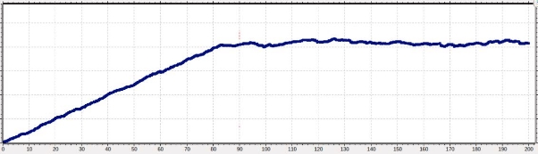
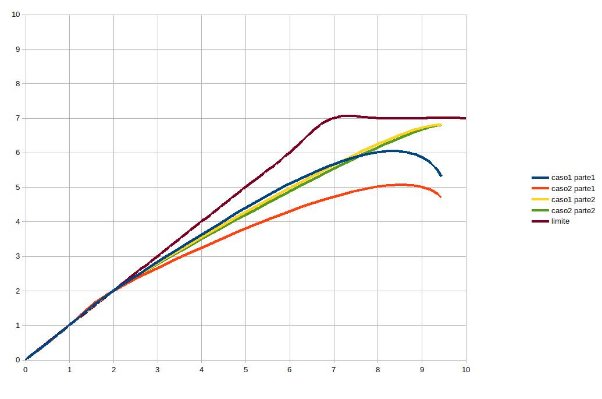

# Laboratorio 3: Transporte

Cátedra de Redes y Sistemas Distribuidos

## Objetivos

- Leer, comprender y generar modelos de red en Omnet++.
- Analizar tráfico de red bajo tasas de datos acotadas y tamaño de buffers limitados.
- Diseñar y proponer soluciones de control de congestión y flujo.

## Modelo de Colas

Se entrega como *kickstarter* un modelo de colas que consta de un generador (gen), una cola (queue) y un destino (sink) conectados en una red Network (definida en el archivo .ned).

En el archivo omnetpp.ini se configura una simulación de 200s donde gen crea y transmite paquetes con intervalos dados por una distribución exponencial de media configurable, y queue es capaz de atenderlos bajo una misma distribución.

El comportamiento de cada módulo se especifica en su respectiva clase en C++, declarada y definida en un único archivo de código (Generator.cc, Queue.cc y Sink.cc). En particular, el módulo Sink toma métricas (.vec y .sca) de la demora de entrega de los paquetes.

## Tarea Análisis

El modelo de colas ignora nociones de capacidad (tasa de transferencia de datos y memoria de buffers). La primera tarea es modificar y extender el proyecto para hacer un **análisis** del impacto de estos parámetros en el tráfico de red.

Debido a que es la primera interacción con Omnet++, se provee una guía paso a paso, con *snippets* de código, que deberá ser complementada con el material de clases y consultas al manual de la herramienta[^1].

### Modificaciones en network.ned

El nodo Generator y Sink pasarán a ser parte de módulos compuestos denominados nodeTx y nodeRx. Deberán contener un buffer de transmisión y recepción que se podrá instanciar con el módulo de cola existente.

Las conexiones deberán configurarse con tasas y demoras de transmisión para dos casos de estudio específicos:

- Caso de estudio 1:
    - NodeTx a Queue: datarate = 1 Mbps y delay = 100 us
    - Queue a NodeRx: datarate = 1 Mbps y delay = 100 us
    - Queue a Sink: datarate = 0.5 Mbps
- Caso de estudio 2:
    - NodeTx a Queue: datarate = 1 Mbps y delay = 100 us
    - Queue a NodeRx: datarate = 0.5 Mbps y delay = 100 us
    - Queue a Sink: datarate = 1 Mbps

El módulo gen deberá tomar como parámetro el tamaño del paquete en Bytes (packetByteSize) que tendrá un valor de 12500 Bytes. Los mismos serán generados en intervalos de tiempos exponenciales con media de 100 ms.

Las queue serán limitados en tamaño de buffer (bufferSize), expresado en cantidad de paquetes. Se configurará con un valor máximo de 200, salvo la cola del nodo transmisor que se dejará arbitrariamente alta[^2].

omnetpp.ini

Dentro del omnetpp.ini los parámetros agregados los tiene que poner aquí, en sección parámetros del network.ned correspondiente a cada nodo y en los archivos cc de cada tipo de nodo para ser reconocidos. ej: buffer size debe agregarse aqui, en el modulo queue.cc y en queue de network.ned

### Modificaciones en clases de C++

Los objetos cMessage no tienen parámetros de tamaño en Bytes. Se deberá cambiar por objetos cPacket y configurar su tamaño en base al parámetro de configuración correspondiente.

Archivo generator.cc

queue.cc

El tiempo de servicio de Queue deberá basarse en la duración de la transmisión del paquete una vez ya encolado (tiene en cuenta la tasa de datos configurada en la conexión).

Se deberá modificar el código de Queue para que controle que el tamaño del buffer no sobrepase el límite configurado. De estar lleno, el nuevo paquete se ignorará y se borrará.

Se deberán agregar nuevas métricas para el análisis en Queue, una que mida la cantidad de paquetes en el buffer, y otra que mida la cantidad de paquetes descartados por buffer saturado.

class Queue: public cSimpleModule // agregar en la definicion de la clase

### Experimentos y Preguntas

Se deberá correr simulaciones paramétricas para cada caso de estudio, variando el intervalo de generación de paquetes (generationInterval) entre 0.1 y 1 en los pasos que el grupo crea adecuado para responder las preguntas planteadas.

Se **deberá** generar algunas gráficas representativas de la utilización de cada una de las 3 queue para los casos de estudios planteados.

Se **sugiere** crear una gráfica de carga transmitida (eje x) vs. carga recibida (eje y), ambas expresadas en paquetes por segundo (ver Figura 6-19 del libro Tanenbaum). En caso de que haya pérdidas de paquetes también se sugiere medir y comparar estadísticas de ese fenómeno.

Responda y justifique

1\. ¿Qué diferencia observa entre el caso de estudio 1 y 2? ¿Cuál es la fuente limitante en cada uno? Investigue sobre la diferencia entre *control de flujo* y *control de congestión* (ver Figura 6-22 del libro Tanenbaum).

## Tarea Diseño

La segunda tarea es diseñar un sistema de control de flujo y congestión (entre el destino y el generador) de manera que se evite la pérdida de datos por saturación de buffers. El grupo es libre de diseñar o inventar o elegir cualquier algoritmo o estrategia que deseen. ¡Sean creativos!

### Modificaciones en network.ned

Se deberá agregar un canal de retorno desde el nodeRx al nodeTx para que el receptor pueda acusar información que regule la tasa de transmisión (*feedback*). Así, las queues evolucionarán a un nuevo módulo denominado transportTx y transportRx[^3].

` `

### Modificaciones en clases de C++

La modificación más importante será generar las clases TransportTx y TransportRx en base a la clase existente Queue. TransportRx deberá ser capaz de enviar información sobre el estado de su buffer a TransportTx para que la ésta regule su flujo de transferencia.

Considere generar un nuevo tipo de paquete (usando la definición de paquetes packet.msg) donde pueda agregar campos necesarios para su protocolo como “tamaño de buffer actual”, “bajar velocidad de transmisión”, “transmitir siguiente paquete”, etc.

Puede usar la función msg->setKind() y msg->getKind para diferenciar entre paquetes que son de datos y paquetes de control (feedback). Por ejemplo, en transportRx se crea el feedback y se configura con el tipo 2:

Mientras que en transportTx se filtra por tipo de paquete recibido, si es 2, es de feedback:

### Experimentos y Preguntas

Utilice los mismos parámetros de los experimentos de la tarea 1, genere las curvas necesarias, y responda:

1\. ¿Cómo cree que se comporta su algoritmo de control de flujo y congestión[^4]? ¿Funciona para el caso de estudio 1 y 2 por igual? ¿Por qué?

## Requisitos del código a entregar

- El código debe ser claro y contener comentarios con detalles de lo que hicieron.
- Se solicita un informe en el que se presenten los análisis de los experimentos y las respuestas a las preguntas de cada tarea. El informe debe estar escrito en texto plano o Markdown. Además deberá contar con un apartado Anexo que especifique si utilizaron herramientas de Inteligencia Artificial (copilot, chatgpt, perplexity, etc.) detallando para qué la utilizaron, como interactuaron con esa herramienta, que diálogos tuvieron y cómo validaron las respuestas que les dio esa herramienta.
- Las entregas serán a través del repositorio Git provisto por la Facultad para la Cátedra, con **fecha límite indicada en el cronograma del aula virtual**.

## Ayuda Tarea Análisis

A modo de ayuda y para saber si van por el camino indicado las simulaciones deberían arrojar un resultado parecido al siguiente:

Si graficamos el delay promedio en toda la simulación tanto el caso 1 y 2 deberían ser parecidos (casi iguales), ya que lo que se busca es evidenciar un mismo problema solo que la diferencia es el lugar específico dónde se encuentra.

Supongamos que empiezo a observar pérdidas de paquetes (tanto en el caso 1 como el caso 2) en el escenario donde el intervalo de generación de paquetes (generationInterval) es 0.1 . Si graficamos el delay promedio en determinado tiempo de la simulación obtendremos una gráfica como la siguiente:

Donde existe un crecimiento en el delay hasta llegar a un máximo, y este máximo puede ser alcanzado en algún tiempo determinado de la simulación, siempre suponiendo que en dicha simulación ocurre el fenómeno de pérdidas de paquetes. Lo importante es saber que en esta gráfica no van a notar diferencias entre el caso 1 y caso 2. **Ya que el problema es el mismo los dos tienen un cuello de botella en diferentes lugares pero es el mismo cuello de botella.**

Lo central en esta primera parte de análisis es observar lo que sucede en cada buffer (emisor, red, receptor) y es ahí donde van a ver diferencias, esta observación nos permitirá identificar cuál de los casos de estudios corresponde a un problema de control de flujo o control de congestión.

## Ayuda Tarea Diseño

Lo interesante luego de solucionar el problema de la pérdida de paquetes tanto para el caso de estudio 1 y 2 ( o sea concéntrense en los casos donde el valor de **generationInterval** ocasionó pérdidas de paquetes ). Lo que se pide es realizar el famoso gráfico de **Carga Ofrecida vs**

**Carga Útil** para eso tómense el tiempo de ver el video nuevamente. Lo importante nuevamente es que esa grafica va a mostrar los resultados de los casos 1 y 2 tanto para el escenario de la red de la primera parte como para el caso 1 y 2 de la segunda parte o sea lo ideal es que sean 4 curvas más una si grafican el limite teorico:

Esta gráfica agrupa los resultados de los distintos escenarios con resṕecto al valor de **generationInterval** mientras más valores de **generationInterval** prueben esta gráfica tendrá más representantes por cada caso y podrán observar con más detalle donde se produce el colapso por congestión que intentamos producir en la parte 1 del laboratorio. Si su diseño del algoritmo no soluciona correctamente algunas de las 2 causas que producen la pérdida de paquetes puede que observen colapso en la parte 2. No se preocupen si ocurre eso puede pasar solo tendrán que explicar las falencias de su implementación.

Recuerde que el resultado de la parte de diseño no es tan importante, o sea si en su diseño no logran el objetivo de no perder paquetes no quiere decir que está mal el lab. Esto quiere decir que su diseño es peor que no hacer nada o un poco mejor aunque no óptimo.

[^1]: Manual de Omnet++ disponible en <https://omnetpp.org/doc/omnetpp/manual/>
[^2]: El transmisor, en general, ya tiene en su memoria el contenido que desea transmitir, por lo que el tamaño de su buffer de salida no suele ser una limitante.
[^3]: Tener en cuenta que usando usando los operadores $i y $o se puede acceder a la entrada o salida independiente de una gate del tipo inout.
[^4]: En caso de implementar control de flujo y control en una sola estrategia, se recomienda evaluar el sistema con un tamaño de buffer de 100 paquetes en la queue conectando el transmisor y receptor. Este escenario permitirá estudiar el algoritmo con ambas funcionalidades operando simultáneamente.
